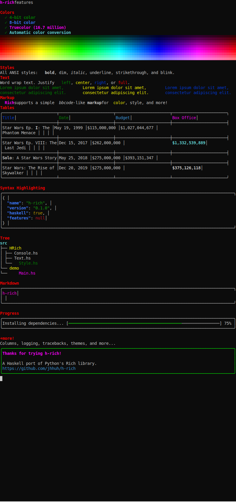

# h-rich

A Haskell port of Python's [Rich](https://github.com/Textualize/rich) library for beautiful terminal output.



## AI Agent Experiment

This project is an experiment to evaluate the ability of AI agents to translate a Python library into Haskell. The entire codebase was generated through AI-assisted development, exploring how effectively modern AI can:

- Understand and translate idioms between dynamically-typed Python and statically-typed Haskell
- Adapt object-oriented patterns to functional programming paradigms
- Maintain feature parity while embracing Haskell's strengths (type safety, composability)

## Features

- **Rich Text** - Styled text with colors (8/16 ANSI, 256-color, TrueColor), bold, italic, underline, and more
- **Markup** - BBCode-like syntax: `[bold red]styled text[/bold red]`
- **Panels** - Bordered containers with customizable box styles (rounded, square, heavy, double)
- **Tables** - Tabular data with headers, alignment, and styling
- **Columns** - Side-by-side horizontal layouts
- **Trees** - Hierarchical tree views with connecting lines
- **Progress Bars** - Visual progress indicators
- **Markdown** - Basic markdown rendering
- **Syntax Highlighting** - Code highlighting (JSON support)
- **Logging** - Structured logging with levels and themes
- **Prompts** - Interactive user input with defaults and confirmation
- **Tracebacks** - Rich exception display

## Installation

```bash
# Using Cabal
cabal build

# Using Nix
nix build
```

## Usage

```haskell
import HRich.Console
import HRich.Text
import HRich.Panel
import HRich.Table

main :: IO ()
main = do
  -- Print styled text
  consolePrint $ mkText "[bold blue]Hello[/bold blue], [italic green]World![/italic green]"

  -- Print a panel
  consolePrint $ mkPanel (mkText "Content inside a panel") "Title"

  -- Print a table
  let table = addRow ["Alice", "30"]
            $ addRow ["Bob", "25"]
            $ addColumn "Age"
            $ addColumn "Name"
            $ mkTable "Users"
  consolePrint table
```

Run the demo to see all features:

```bash
cabal run h-rich-demo
```

## Modules

| Module | Description |
|--------|-------------|
| `HRich.Console` | Entry point for printing to terminal |
| `HRich.Text` | Rich text with markup parsing |
| `HRich.Style` | Style attributes (bold, italic, colors) |
| `HRich.Color` | Color system (ANSI, 256, TrueColor) |
| `HRich.Panel` | Bordered container component |
| `HRich.Table` | Table layout component |
| `HRich.Columns` | Horizontal layout component |
| `HRich.Tree` | Hierarchical tree component |
| `HRich.Progress` | Progress bar component |
| `HRich.Markdown` | Markdown rendering |
| `HRich.Syntax` | Syntax highlighting |
| `HRich.Log` | Structured logging |
| `HRich.Prompt` | Interactive prompts |
| `HRich.Theme` | Theme system |
| `HRich.Traceback` | Exception display |

## Architecture

The library uses a typeclass-driven design:

- **`Renderable`** - Core typeclass for anything that can be displayed
- **`Segment`** - Atomic unit of rendered output (text + style)
- **Composition** - Components compose functionally via the `Renderable` interface

## License

BSD-3-Clause
